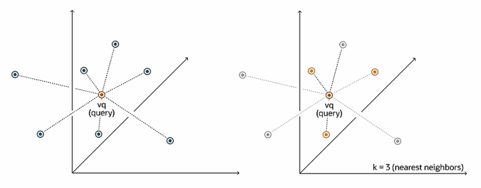

# Finding the Closest Vectors

The **similarity search** allows you to calculate the query vector distance to all other vectors.  What is important is the **result set of your top closest vectors** not the distance between them. This comparison is done using a particular distance metric (e.g. Euclidean).

## Exact Similarity Search

- Also called *Flat Search* or *Exact Search*
- Most accurate results
- Perfect search quality
- Potentially significant search times

*In this example here, we have a vector query and we're trying to locate the three nearest neighbors. After calculating all of the distances of all of the vectors, the search returns the nearest k of those as the nearest match. This is called the **k nearest-neighbors search**.*

