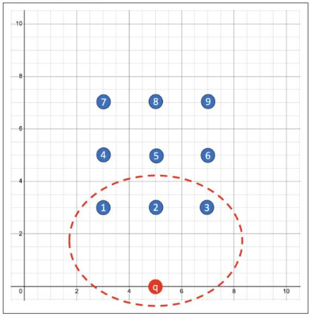

# Finding the Closest Vectors

The **similarity search** allows you to calculate the query vector distance to all other vectors.  What is important is the **result set of your top closest vectors** not the distance between them. This comparison is done using a particular distance metric (e.g. Euclidean).

## Exact Similarity Search

- Also called *Flat Search* or *Exact Search*
- Most accurate results
- Perfect search quality
- Potentially significant search times

*In this example here, we have a vector query and we're trying to locate the three nearest neighbors. After calculating all of the distances of all of the vectors, the search returns the nearest k of those as the nearest match. This is called the **k nearest-neighbors search**.*


### Euclidean Similarity Search

In this example, ```docID``` and ```embedding``` are columns that are defined in the ```vector_tab``` table. The embedding column has the data type of vector.

```
SELECT docID
FROM vector_tab
ORDER BY VECTOR_DISTANCE(embedding, :query_vector, EUCLIDEAN)
FETCH EXACT FIRST 10 ROWS ONLY;
```

### Euclidean Squared Similarity Search

In the case of Euclidean distances, comparing squared distances is equivalent to comparing distances. So when ordering is more important than the distance values themselves, the Euclidean squared distance is very useful, as it is faster to calculate than the Euclidean distance, avoiding the square-root calculation.

```
SELECT docID
FROM vector_tab
ORDER BY VECTOR_DISTANCE(embedding, :query_vector)
FETCH FIRST 10 ROWS ONLY;
```

## Approximate Similarity Search

- Uses vector indexes
    - Hiearchical Navigable Small World (HHSW) indexes
    - Inverted File Flat (IVF) indexes
- Fast and accurate
- Can be more efficient
- Can be less accurate
- Uses target accuracy

**Note**. In order to use vector indexes, you have to ensure that you have enabled the vector pool in the SGA.

### Example: Hiearchical Navigable Small World (HHSW) indexes

```
CREATE VECTOR INDEX galaxies_hnsw_idx ON galaxies (embedding)
    ORGANIZATION INMEMORY NEIGHBOR GRAPH 
    DISTANCE COSINE WITH TARGET ACCURACY 95;

SELECT name
FROM galaxies
WHERE name <> 'NGC1073'
ORDER BY VECTOR_DISTANCE (embedding, to_vector('[0,1,1,0,0]', COSINE)
FECTH APPROXIMATE FIRST 3 ROWS ONLY;
```
### Example: Inverted File Flat (IVF) indexes

```
CREATE VECTOR INDEX galaxies_ivf_idx ON galaxies (embedding)
    ORGANIZATION NEIGHBOR PARTITIONS 
    DISTANCE COSINE WITH TARGET ACCURACY 95;

SELECT name
FROM galaxies
WHERE name <> 'NGC1073'
ORDER BY VECTOR_DISTANCE (embedding, to_vector('[0,1,1,0,0]', COSINE)
FECTH APPROXIMATE FIRST 3 ROWS ONLY;
```

## Approximate Similarity Search vs Exact Similarity Search

In this example, the approximate search finds four of the five closest neighbors. In this case, the search accuracy is 80%. So you see that there is a **trade off between speed and accuracy** when using approximate similarity search.


## Multi-Vector Similarity Search

- Usually for multi-document search
- Documents are split into chunks
- Chunks embedded individually into vectors
- Uses partitions

A multi-vector search consists of retrieving the top k vector matches, using the partitions based on the document's characteristics. The ability to score documents based on the similarity of their chunks to a query vector being searched is facilitated in SQL using the **partitioned row-limiting clause** (*). If we don't meet these three criteria, then **the record will be filtered out**. Multi-vector search with the partitioning row limit clause **does not use vector indexes**.

(*) The partition row-limiting clause extension is a generic extension of the SQL language.

### Example

*What are the four best matching sentences found in the three best matching paragraphs of the two best matching books?*

#### Using Exact Similarity Search

```
SELECT bookId, paragraphId, sentence
FROM books
ORDER BY VECTOR_DISTANCE (embedding, :query_vector)
FECTH FIRST 2 PARTITIONS BY bookId, 
            3 PARTITIONS BY paragraphId,
            4 ROWS ONLY;
```

#### Using Approximate Similarity Search

```
SELECT bookId, paragraphId, sentence
FROM books
ORDER BY VECTOR_DISTANCE (embedding, :query_vector)
FECTH APPROXIMATE FIRST 2 PARTITIONS BY bookId, 
                        3 PARTITIONS BY paragraphId,
                        4 ROWS ONLY
                        WITH TARGET ACCURACY 90;
```

## Finding the Closest Vectors to a Given Vector

```
CREATE TABLE IF NOT EXISTS t7 (
    id   NUMBER PRIMARY KEY , 
    v    VECTOR(2, FLOAT32)
); 

INSERT INTO t7  
     VALUES (1, '[3, 3]'), (2, '[5, 3]'), (3, '[7, 3]'), 
            (4, '[3, 5]'), (5, '[5, 5]'), (6, '[7, 5]'), 
            (7, '[3, 7]'), (8, '[5, 7]'), (9, '[7, 7]');  
            
COMMIT;

SELECT id
FROM t7
ORDER BY VECTOR_DISTANCE(TO_VECTOR('[5, 0]'), v, EUCLIDEAN)
FETCH FIRST 3 ROWS ONLY;
```



