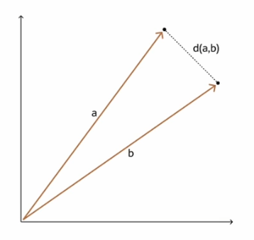

# Finding the Nearest Vectors

The **Vector Constructor** is a function that allows us to create vectors without having to store those in a column in a table. You get to specify the vector values, but dimensions are optional, and the format is optional as well.

```
SELECT VECTOR('[10, 2]');

SELECT VECTOR('[10, 2]', 2, float32);
```

## Vector Distance Operand

The ```VECTOR_DISTANCE``` is the main function to calculate distances between two vectors. Optionally, you can specify a metric (default is ```COSINE```).

The ```VECTOR_DISTANCE``` function can be used to perform a **similarity search**.

If a similarity search query does **not** specify a distance metric, then the default ```COSINE``` metric will be used for both exact and approximate searches.

If a similarity search query does specify a distance metric, then an exact search with that distance metric is used if it conflicts with the distance metric specified in a vector index. If the two distance metrics are the same, then this will be used for both exact as well as approximate searches.

```
SELECT TO_NUMBER(
    VECTOR_DISTANCE(
        VECTOR('[0, 0]'),
        VECTOR('[10, 0]'),
        EUCLIDEAN
    )
) as EUCLIDEAN_DISTANCE;
```

## Vector Distance Metrics

- Euclidean and Euclidean Squared Distances
    - Straight-line distance between two vectors
    - Use the Pythagorean theorem
    - Sensitive to vector size and direction
    - When ordering is more important than the distance, the squared distance is very useful and faster to calculate
- Cosine Similarity
    - Widely used
    - A smaller angle indicates greater similarity
    - While cosine distance measures how different two vectors are, cosine similarity measures how similar two vectors are
- Dot Product Similarity
    - Multiply the size of each vector but the cosing of their angle
    - Equivalent to sum of vector's coordinates
    - Larger means more similar, smaller means less similar
- Manhattan Distance
    - Useful for describing uniform grids
    - It is most useful for vectors describing objects on a uniform grid such as city blocks, power grids, or perhaps a chessboard
    - Faster than Euclidean Metric
- Hamming Similarity
    - Describe where vector dimensions differ
    - They are binary vectors
    - Number of bits required to change for a match
    - It compares the position of each bit in the sequence
    - Used in order to detect network errors

## Shorthand Operators For Distances

- ```<->``` is the euclidean distance operator
    - equivalent to ```L2_DISTANCE(expr1, expr2)```
    - equivalent to ```VECTOR_DISTANCE(expr1, expr2, EUCLIDEAN)```
- ```<=>``` is the cosine distance operator
    - equivalent to ```COSINE_DISTANCE(expr1, expr2)```
    - equivalent to ```VECTOR_DISTANCE(expr1, expr2, COSINE)```
- ```<#>``` is the negative dot product operator
    - equivalent to ```-1 * INNER_PRODUCT(expr1, expr2)```
    - equivalent to ```VECTOR_DISTANCE(expr1, expr2, DOT)```

## Examples

```
SELECT TO_NUMBER(
    VECTOR('[0, 0]') <-> VECTOR('[10, 0]')
) as EUCLIDEAN_DISTANCE;
```

## Euclidean and Euclidean Squared Distances



## Cosine Similarity


## Dot Product Similarity


## Manhattan Distance


## Hamming Similarity

