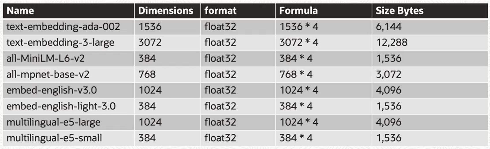
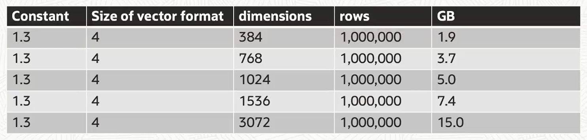

# Vector Indexes And Memory

Vector Indexes are specialized indexing data structures that can make your queries more efficient against your vectors.

Vector Indexes use techniques such as:
- Clustering
- Partitioning
- Neighbor graphs

Vector Indexes greatly reduce the search space. They do require that you enable the Vector Pool in the SGA.

Oracle AI Vector Search supports two types of indexes:
- **In-Memory Neighbor Graph Vector Index**
    - *Hierarchical Navigable Small World (HNSW)* is the only type supported
    - HNSW are very efficient for vector approximate similarity search.
- **Neighbor Partition Vector Index**
    - *Inverted File Flat Index* is the only type supported
    - They balances high search quality with reasonable speed

## Vector Pool Area

In order to be able to use vector indexes, you need to enable the Vector Pool Area with ```VECTOR_MEMORY_SIZE``` parameter.

```ALTER SYSTEM SET vector_memory_size=1G SCOPE=BOTH;```

**Note.**    Large vector indexes do need lots of RAM and RAM constrains the vector index size. You should use IVF indexes when there is not enough RAM. IVF index is used both the buffer cache as well as disk.


## Memory Considerations

The size of a vector depends upon the embedding model that you use to create those embeddings. 

Most popular vectors are between 1.5 and 12 KB in size.

Oracle AI Vector Search supports:
- INT8
- FLOAT32
- FLOAT64

Oracle AI Vector Search supports vectors with up to 65,535 dimensions.

*In this example, we're using the FLOAT32 format, which is 4 bytes in size. And so the size would be the number of dimensions multiplied by how many bytes for that format.*



## Indexes Memory Size

In-Memory Neighbor Graph Indexes are stored:
- On-Disk
- In-Memory

The In-Memory size formula is:

    (1.3) * (size of vector format) * (# of dimensions) * (# of rows)

*NOTE: 1.3 is an approximation for the overhead and graph layers*

