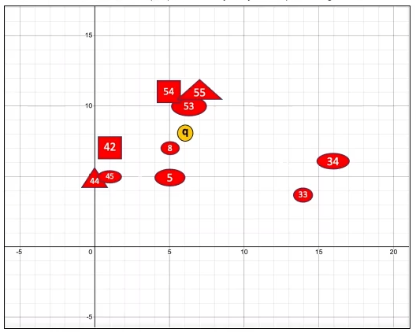

# Narrowing Search Results

When working with vectors, you are not limited to the use of the ```ORDER BY``` clause. You can use the ```WHERE``` clause with the ```VECTOR_DISTANCE``` function in order to return **data that is filtered**.

## Attribute Filtering

```
SELECT id, v, shape_color
FROM t3
WHERE shape_color = 'Red'
ORDER BY VECTOR_DISTANCE(v, TO_VECTOR('[6, 8]'))
FETCH FIRST 5 ROWS ONLY
```


