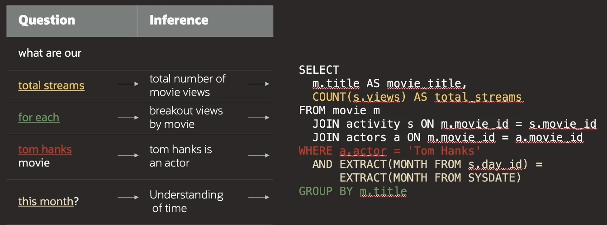

# Select AI With Autonomous DB

**Select AI** is the simplest way to get answers about your business. All you have to do is use your **natural language** in order to just ask a question. The Autonomous DB manages the entire query process to produce your answer.

## Select AI Benefits

- **Simple**
    - Easily build generative AI into new or existing applications
- **Future-Enabled**
    - Choose from an array of LLMs
    - Pick the model that is best suited to your business
- **Secure**
    - Rely on the same DB security that protects the data
    - Data will not be sent to the LLM provider

## Select AI: SQL

Select AI **translates natural language into Oracle SQL language** using an LLM.



## Examples

```
begin
    -- Drop the AI profile (if already exists)
    DBMS_CLOUD_API.DROP_PROFILE(
        profile_name => 'COHERE',
        force        => true
    );

    -- Specify the LLM provider, your credential and the table/views used for queries
    -- NOTE: omit the table from the list to include all objects in the schema
    DBMS_CLOUD_AI.CREATE_PROFILE(
        profile_name => 'COHERE',
        attributes => '{
            "provider": "OCI",
            "credential_name": "OCI$RESOURCE_PRINCIPAL",
            "object_list": [
                {"owher": "MOVIESTREAM", "name": "movies"},
                {"owher": "MOVIESTREAM", "name": "streams"},
                {"owher": "MOVIESTREAM", "name": "actors"}
            ],
            "region": "eu-milan-1"
        }'     
    )

    -- Set the AI profile for this session
    DBS_CLOUD_AI.SET_PROFILE(
        profile_name => 'COHERE'
    )
end;


SELECT DMS_CLOUD_AI.GENERATE(
    profile_name => 'COHERE',
    action       => 'chat',
    prompt       => 'What is Oracle Autonomous DB?')
```