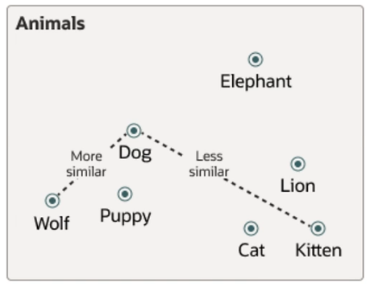

# Oracle AI Vector Search

One of the biggest benefits of Oracle AI Vector Search is that **semantic search on unstructured data** can be combined with **relational search on business data**. This eliminates ata fragmentation between multiple systems.

Oracle AI Vector Search also supports **Retrieval Augmented Generation (RAG)**, a breakthrough generative AI technique that combines large language models (LLMs) and private business data. RAG provides higher accuracy and avoids having to expose private data by including it in the large language model training data.

## Vector Data Type

**Vector Data Type** was introduced in Oracle Database 23ai. 

Vector Data Type allows you to store vector embeddings alongside other business data. In other words, it allows you to apply semantic queries on business data.

## Vector Embeddings

Vector embeddings are **mathematical representations of data points**. They assign mathematical representations based on meaning and context of unstructured data.

Vector embeddings can be used to **represent almost any type of data**, including text, audio, or visual such as pictures. And they are used in **proximity searches**.

In order to get vector embeddings, you can either use ONNX embedding machine learning models or access third-party REST APIs.

## Similarity Search

Vector data is usually unevenly distributed and clustered into groups that are semantically related. Doing a similarity search based on a given query vector is equivalent to retrieving the **k nearest vectors** to your query vector in your vector space. **It is important to find the relative order of distances rather than the actual distance.**

Similarity searches tend to get data from one or more clusters, depending on the value of the query vector and the fetch size. Searches can be approximate or specific.

*Example. The distance between dog and wolf in the vector space is shorter than the distance between dog and kitten. So in this space, a dog is more similar to a wolf than it is to a kitten.*

