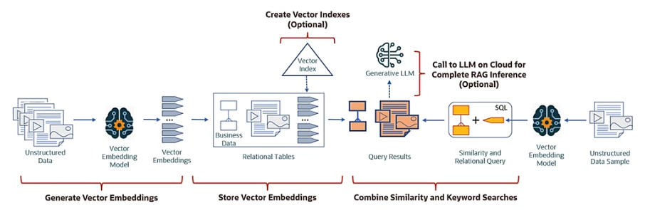

# Oracle AI Vector Search Workflow



## Step 1 - Generate Vector Embeddings

Load the ONNX model called ```my_embedding_model``` into the Oracle Database.

```
EXECUTE dbms_vector.load_onnx_model (
    directory  => 'DM_DUMP'
    file_name  => 'my_embedding_model.onnx',
    model_name => 'doc_model'
);
```

Use the ```SELECT``` statement to converts an input string ("Hello") to an embedding.

```
SELECT TO_VECTOR(VECTOR_EMBEDDING(doc_model USING 'hello' as data)) as embedding;
```

## Step 2 - Store Vector Embeddings

Create one or more columns of ```vector``` data type.

## Step 3 - Create Vector Indexes (Optional)

Create vector indexes in the event that you have huge vector spaces.

**Note.** *This is an optional step, but this is beneficial for running similarity searches over those huge vector spaces.*

## Step 4 - Combine Similirarity and Keyword Searches

Native SQL operations to combine similarity searches with relational searches in order to retrieve relevant data.

## Step 5 - Call to LLM for Complete RAG Inference (Optional)

Use the similarity search results to generate a prompt and send it to your generative LLM in order to complete your RAG pipeline.